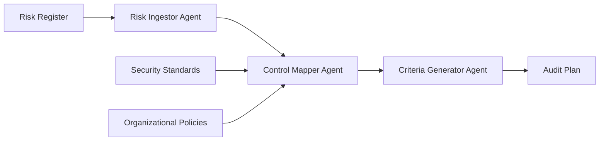

# Multi-Agent AI for IoT Security Audit Planning

🔒 **Automated IoT Security Audit Planning using Multi-Agent AI Systems**

A sophisticated AI-powered tool that automatically generates comprehensive audit plans for IoT security assessments. This system uses multiple specialized AI agents to analyze risk registers, map security controls, and create detailed audit criteria based on industry standards like ETSI EN 303 645.

## 🎯 Overview

This tool transforms the traditionally manual and time-intensive process of IoT audit planning into an automated, intelligent workflow. Security professionals can input their risk registers and organizational policies, and the system will generate detailed, actionable audit plans that comply with industry standards.

### Key Benefits for Security Professionals

- **Time Savings**: Reduce audit planning time from days to minutes
- **Comprehensive Coverage**: Ensure all critical risks are addressed with appropriate controls
- **Standards Compliance**: Automatically align with ETSI EN 303 645 and custom organizational policies
- **Consistent Quality**: Generate standardized, professional audit criteria every time
- **Risk-Based Approach**: Prioritize audit activities based on actual risk levels

## 🏗️ How It Works

The system employs three specialized AI agents working in sequence:



1. **Risk Ingestor Agent**: Analyzes and prioritizes risks from your risk register
2. **Control Mapper Agent**: Maps risks to relevant security controls from standards and policies
3. **Criteria Generator Agent**: Creates detailed, testable audit criteria

## 📋 Prerequisites

### Required API Keys
- **OpenAI API Key**: For the AI agents
- **Google API Key**: For evaluation and quality assessment (RAGAS)

### Input Data Requirements
Your organization needs to provide:
- **Risk Register** (CSV format)
- **Security Standards** (TXT format) - ETSI EN 303 645 included
- **Organizational Policies** (TXT format) - Optional but recommended

## 🚀 Quick Start

### 1. Setup Environment

```bash
# Clone the repository
git clone https://github.com/abyasham/multi-agent-security-audit-planner.git
cd multi-agent-security-audit-planner

# Install dependencies (if running locally)
pip install openai langchain llama-index ragas transformers sentence-transformers
```

### 2. Prepare Your Data

#### Risk Register Format (CSV)
```csv
riskId,description,impact,likelihood,priority_score
R-001,"Unauthorized HVAC access allows temperature manipulation",High,Medium,6
R-002,"Default passwords on IoT cameras provide easy access",High,High,9
```

#### Security Standards Format (TXT)
```text
Provision 1: No universal default passwords
All IoT device passwords shall be unique per device...

Provision 2: Implement vulnerability management
A vulnerability disclosure policy shall be publicly available...
```

### 3. Run the Audit Planner

Open the Jupyter notebook [`Multi_agent_AI_for_IoT_Audit_Planning_v2.ipynb`](Multi_agent_AI_for_IoT_Audit_Planning_v2.ipynb) and:

1. **Configure API Keys** (Cell 2):
   ```python
   # Set your API keys in Google Colab secrets or environment variables
   os.environ['OPENAI_API_KEY'] = 'your-openai-key'
   os.environ['GOOGLE_API_KEY'] = 'your-google-key'
   ```

2. **Update File Paths** (Cell 3):
   ```python
   file_paths = {
       "risk_register": "/path/to/your/risk_register.csv",
       "security_docs_dir": "/path/to/your/security/documents",
       "ground_truth": "/path/to/ground_truth_audit_plan.json"  # Optional
   }
   ```

3. **Execute All Cells**: Run the notebook from top to bottom

## 📊 Sample Output

The system generates comprehensive audit plans in JSON format:

```json
{
  "auditPlan": {
    "metadata": {
      "scope": "IoT Security Compliance Audit - Smart Office Environment",
      "framework": "ETSI EN 303 645 & Internal Policy",
      "totalCriteria": 30,
      "riskCoverage": "100%"
    },
    "auditCriteria": [
      {
        "criterionId": "AC-001",
        "priority": "High",
        "description": "Verify that default passwords have been changed on IoT security cameras...",
        "testingGuidance": "1. Select sample of 20% of cameras 2. Attempt login with defaults...",
        "sourceRisk": {
          "riskId": "R-002",
          "description": "Default passwords provide easy access",
          "riskLevel": "High"
        },
        "sourceControl": {
          "controlId": "Provision 1",
          "title": "No universal default passwords"
        }
      }
    ]
  }
}
```

## 📁 Dataset Structure

```
dataset/
├── risk_register.csv              # Your organization's risk register
├── iot_security_standard.txt      # ETSI EN 303 645 provisions
└── ground_truth_audit_plan.json   # Reference audit plan (optional)
```

### Risk Register Fields
- **riskId**: Unique identifier (e.g., R-001)
- **description**: Detailed risk description
- **impact**: Risk impact level (Critical/High/Medium/Low)
- **likelihood**: Probability of occurrence (High/Medium/Low)
- **priority_score**: Numerical priority (1-12)

## 🎯 Use Cases

### 1. Annual IoT Security Audits
Generate comprehensive audit plans for yearly security assessments covering all IoT devices in your environment.

### 2. Compliance Assessments
Ensure your IoT deployments meet ETSI EN 303 645 requirements with automatically generated compliance checklists.

### 3. Risk-Based Auditing
Focus audit efforts on the highest-priority risks identified in your risk register.

### 4. Vendor Assessments
Create standardized audit criteria for evaluating IoT vendors and their security practices.

## 📈 Quality Assurance

The system includes built-in evaluation using the RAGAS framework, measuring:

- **Faithfulness**: How well audit criteria reflect the source documents
- **Answer Relevancy**: Relevance of generated criteria to identified risks
- **Context Precision**: Accuracy of control mapping
- **Context Recall**: Completeness of risk coverage

## 🔧 Customization

### Adding Custom Security Standards
1. Create a new TXT file with your organization's security policies
2. Add the file path to the `security_docs_dir` in Cell 3
3. The system will automatically incorporate these standards

### Modifying Risk Prioritization
Adjust the risk scoring algorithm in the `RiskIngestorAgent` class to match your organization's risk methodology.

## 📚 Research Background

This tool is based on research into multi-agent AI systems for automated security audit planning. The methodology and evaluation results are detailed in the accompanying research paper: [`Multi_Agent_Automated_IoT_audit_planning.pdf`](paper/Multi_Agent_Automated__IoT_audit_planning.pdf).

## 🔗 Related Resources

- [ETSI EN 303 645 Standard](https://www.etsi.org/deliver/etsi_en/303600_303699/303645/02.01.01_60/en_303645v020101p.pdf)
- [NIST IoT Security Guidelines](https://www.nist.gov/cybersecurity/iot)
- [OWASP IoT Security](https://owasp.org/www-project-internet-of-things/)

---

**Built for Security Audit Professionals, by Security Audit Professional** 🛡️
